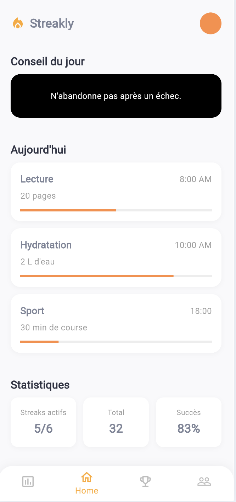
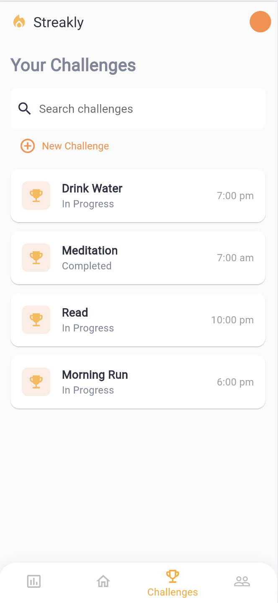
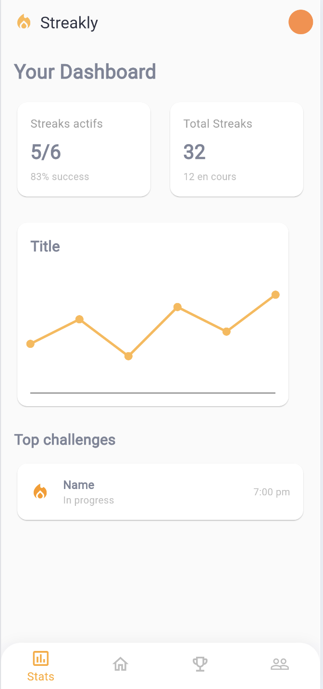
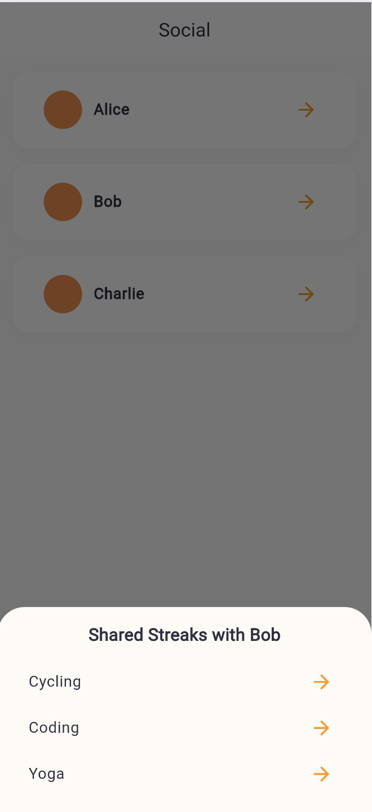
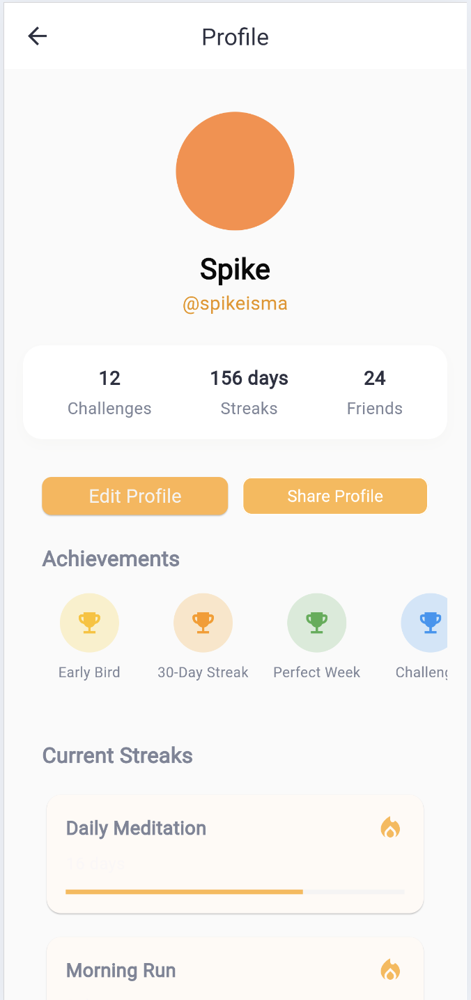

# Streakly MVP

[](https://opensource.org/licenses/MIT)
[](https://flutter.dev/)
[](https://dart.dev/)

> **Streakly** is a modern habit tracking and challenge management application designed to help users build positive habits, track their progress, and stay motivated through social features and gamification.

## Screenshots

| Home Screen | Challenges Screen | Dashboard Screen |
|:-----------:|:----------------:|:---------------:|
|  |  |  |

| Social Screen | Profile Screen |
|:-------------:|:--------------:|
|  |  |

## What is Streakly?

Streakly is a comprehensive habit tracking application that combines the power of streak tracking with social motivation and challenge-based gamification. The app helps users:

- **Track Daily Habits**: Monitor your daily routines and build consistent habits
- **Create Challenges**: Set personal challenges and track your progress
- **Stay Motivated**: Get inspired by daily tips and motivational content
- **Connect Socially**: Share your progress with friends and family
- **Visualize Progress**: See your achievements through detailed statistics and charts
- **Build Streaks**: Maintain momentum with streak tracking and milestone celebrations

## Key Features

### Home Screen
- **Daily Tips**: Get motivational advice to keep you going
- **Today's Tasks**: View and complete your daily habit tasks
- **Progress Tracking**: Visual progress bars for each habit
- **Quick Stats**: Overview of your active streaks and success rate

### Challenges Screen
- **Challenge Management**: Create, edit, and track personal challenges
- **Search Functionality**: Find specific challenges quickly
- **Status Tracking**: Monitor challenge progress (In Progress, Completed)
- **Time Scheduling**: Set specific times for habit reminders

### Dashboard Screen
- **Statistics Overview**: View your active streaks and total achievements
- **Progress Charts**: Visual representation of your habit data
- **Top Challenges**: Quick access to your most important habits
- **Performance Metrics**: Success rates and streak analytics

### Social Features
- **Friend Connections**: Connect with friends and family
- **Shared Streaks**: Collaborate on habits with others
- **Progress Sharing**: Share your achievements and milestones
- **Community Support**: Get motivated by seeing others' progress

### Profile Management
- **Personal Information**: Manage your profile and preferences
- **Achievement System**: Unlock badges and milestones
- **Current Streaks**: View all your active habit streaks
- **Statistics**: Comprehensive overview of your habit journey

## Getting Started

### Prerequisites
- Flutter SDK (3.0 or higher)
- Dart SDK (3.0 or higher)
- Android Studio / VS Code with Flutter extensions
- iOS Simulator (for iOS development) or Android Emulator

### Installation

1. **Clone the repository**
   ```bash
   git clone https://github.com/yourusername/MVP_Streakly.git
   cd MVP_Streakly
   ```

2. **Install dependencies**
   ```bash
   cd streakly_app
   flutter pub get
   ```

3. **Run the application**
   ```bash
   flutter run
   ```

### Building for Production

**Android APK:**
```bash
flutter build apk --release
```

**iOS App Bundle:**
```bash
flutter build ios --release
```

**Web Version:**
```bash
flutter build web --release
```

## Architecture & Technical Details

### Status: MVP (Minimum Viable Product)
This project is a functional first version, designed to validate concepts and user experience. It is not a final version. Several features and optimizations are planned for future iterations (see below).

### Technologies Used
- **Flutter** (Dart): Main framework for cross-platform development (iOS, Android, Web, Desktop)
- **Material Design**: For consistent UI/UX across platforms
- **Modular Architecture**: Clear separation between models, screens, widgets, etc.
- **State Management**: Provider/Riverpod for reactive state management
- **Local Storage**: SharedPreferences for data persistence
- **Charts & Visualizations**: Custom chart implementations for progress tracking

## Project Structure
```
streakly_app/
├── lib/
│   ├── models/           # Data models (Challenge, User, etc.)
│   ├── screens/          # Main app screens (auth, home, profile, etc.)
│   │   ├── auth/         # Authentication screens
│   │   └── ...           # Other screen directories
│   ├── widgets/          # Reusable widgets and UI components
│   │   ├── charts/       # Chart and visualization widgets
│   │   └── ...           # Other widget directories
│   ├── app.dart          # Main app configuration
│   └── main.dart         # Application entry point
├── assets/
│   ├── images/           # App images and screenshots
│   └── icons/            # App icons and graphics
├── test/                 # Unit and widget tests
└── pubspec.yaml          # Dependencies and project configuration
```

## Technical Documentation
A comprehensive `doc/` folder has been created to provide detailed documentation **file by file**. Each technical aspect (models, navigation, widgets, business logic, etc.) is explained by experts.

### Available Documentation:
- **Architecture**: Overall system design and technical choices
- **Models**: Data structures and business logic
- **Screens**: UI/UX implementation and navigation flow
- **Widgets**: Reusable component library
- **State Management**: Data flow and state handling
- **Assets**: Resource management and optimization
- **Roadmap**: Future development plans and features

## Planned Future Evolutions

### Authentication & Security
- **Advanced Authentication**: OAuth integration, biometric authentication
- **User Management**: Account creation, profile customization
- **Data Security**: End-to-end encryption for sensitive data

### Enhanced Features
- **Push Notifications**: Smart reminders and milestone celebrations
- **Cloud Synchronization**: Cross-device data sync and backup
- **Offline Mode**: Full functionality without internet connection
- **Dark/Light Theme**: Dynamic theme switching based on system preferences

### Analytics & Insights
- **Advanced Statistics**: Detailed analytics and progress insights
- **Custom Charts**: Interactive visualizations and trend analysis
- **Goal Setting**: SMART goal framework integration
- **Progress Reports**: Weekly/monthly progress summaries

### Internationalization
- **Multi-language Support**: i18n for global accessibility
- **Localization**: Region-specific features and content
- **Cultural Adaptation**: UI/UX adjustments for different cultures

### Testing & Quality
- **Comprehensive Testing**: Unit, integration, and E2E tests
- **Performance Optimization**: App performance and battery optimization
- **Accessibility**: WCAG compliance and screen reader support
- **Code Quality**: Automated code analysis and linting

### Social & Community
- **Community Features**: Public challenges and leaderboards
- **Gamification**: Achievement system and rewards
- **Social Sharing**: Integration with social media platforms
- **Mentorship**: Connect with habit mentors and coaches

## Development

### Running the Project
```sh
cd streakly_app
flutter pub get
flutter run
```

### Testing
```sh
# Run unit tests
flutter test

# Run widget tests
flutter test test/widget_test.dart

# Run integration tests
flutter drive --target=test_driver/app.dart
```

### Code Style
This project follows the official Dart style guide. Use `dart format` to format your code:
```sh
dart format lib/
```

## Contributing

We welcome contributions from the community! Here's how you can help:

### Reporting Bugs
- Use the GitHub issue tracker
- Provide detailed reproduction steps
- Include device information and error logs

### Feature Requests
- Open a feature request issue
- Describe the use case and expected behavior
- Consider the impact on existing features

### Code Contributions
1. Fork the repository
2. Create a feature branch (`git checkout -b feature/amazing-feature`)
3. Commit your changes (`git commit -m 'Add amazing feature'`)
4. Push to the branch (`git push origin feature/amazing-feature`)
5. Open a Pull Request

### Documentation
- Improve existing documentation
- Add code comments and examples
- Update README and technical docs

## License

This project is licensed under the **MIT License** - see the [LICENSE](LICENSE) file for details.

### Commercial Use

**Commercial use is explicitly permitted** under the MIT License. You are free to:

- Use Streakly for commercial purposes
- Modify and distribute the code
- Use it in proprietary software
- Sell applications based on this code
- Use it in any commercial project

The MIT License is one of the most permissive open-source licenses, allowing maximum freedom for both personal and commercial use while only requiring that the original license and copyright notice be preserved.

## Acknowledgments

- **Flutter Team**: For the amazing cross-platform framework
- **Material Design**: For the design system and guidelines
- **Open Source Community**: For the libraries and tools that make this possible
- **Beta Testers**: For valuable feedback and bug reports

---

## Support & Contact

- **Documentation**: Check the `doc/` folder for detailed technical information
- **Issues**: Use GitHub Issues for bug reports and feature requests
- **Discussions**: Join our community discussions for general questions
- **Email**: ismail.moudden1@gmail.com for business inquiries and security reports

**Made with ❤️ by the Streakly Team**
